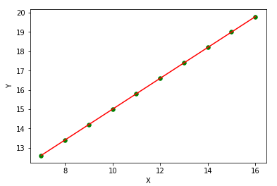
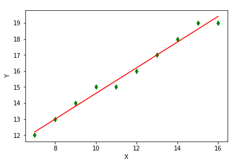
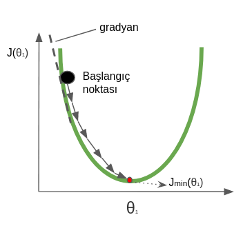

Emre: So, what exactly is *Bayesian* inference?

Kaan: Let me walk you through an example. We’ll revisit the classical linear-regression problem and then look at its Bayesian interpretation.

## 1  Deterministic View

Suppose the taxi from home to the airport charges a fixed 7 TL flag-drop plus 0.8 TL per kilometre. With distance $X$ and fare $Y$:

$$
Y = 7 + 0.8X
$$

Because we *know* the parameters, we can predict the cost of every trip exactly. Plotting the data gives a perfect straight line:



## 2  Classical (Frequentist) Linear Regression

Now imagine we *don’t* know the pricing formula. We record a handful of $(X,Y)$ pairs from the meter (rounding the decimals for simplicity) and want to fit

$$
Y \approx \theta_0 + \theta_1X.
$$

The ordinary least squares (OLS) estimator chooses $\theta$ to minimise the **Residual Sum of Squares (RSS)**

$$
\text{RSS}(\theta) = \sum_{i}(y_i-\hat y_i)^2.
$$

Taking gradients or using matrix algebra yields the familiar closed-form solution, or we can apply gradient descent when features proliferate.



## 3  Bayesian Linear Regression

The Bayesian twist is to treat $\theta_0$ and $\theta_1$ not as fixed but as *random variables* with a **prior** distribution. After observing data $\mathcal D$, Bayes’ rule updates the prior to a **posterior**:

$$
P(\theta\mid \mathcal D) \propto P(\mathcal D\mid \theta)\,P(\theta).
$$

For linear regression with Gaussian noise and a Gaussian prior, the posterior is also Gaussian (conjugacy). Unlike OLS—which spits out a single line—Bayesian regression delivers a *distribution* over lines, letting us quantify uncertainty.

### Posterior Predictive Distribution

For a new input $x_*$, the predictive distribution is

$$
P(y_*\mid x_*,\mathcal D) = \int P(y_*\mid x_*,\theta)\,P(\theta\mid\mathcal D)\,d\theta \;=\; \mathcal N(\mu_*,\sigma_*^2)
$$

with closed-form expressions for $\mu_*$ and $\sigma_*^2$.

### Visual Example in Python

```python
import numpy as np, matplotlib.pyplot as plt
from scipy.stats import invgamma, norm

# synthetic data
dist = np.array([2, 4, 6, 8, 10])
fare = np.array([8.3, 10.2, 13.4, 14.9, 15.8])
X = np.c_[np.ones(len(dist)), dist]

# prior: theta ~ N(0, 10 I)
prior_mu  = np.zeros(2)
prior_cov = 10*np.eye(2)

sigma2 = 0.25  # assumed noise variance
Sigma_n = np.linalg.inv(np.linalg.inv(prior_cov) + (1/sigma2)*X.T@X)
mu_n    = Sigma_n@(np.linalg.inv(prior_cov)@prior_mu + (1/sigma2)*X.T@fare)

# sample a few lines from posterior
xs = np.linspace(0,12,100)
for _ in range(5):
    theta = np.random.multivariate_normal(mu_n, Sigma_n)
    plt.plot(xs, theta[0]+theta[1]*xs, alpha=.4)
plt.scatter(dist, fare, c='k', label='data'); plt.legend(); plt.show()
```

The grey lines visualise plausible price functions, thicker where predictions are certain, wider spread where they aren’t.

## 4  Gradient Descent Refresher

When dimensions explode, the closed-form inverse $(X^TX)^{-1}$ is costly. Gradient-based optimisation iteratively updates $\theta$ in the direction of steepest descent:

$$
\theta \leftarrow \theta - \eta\,\nabla_\theta \text{RSS}(\theta).
$$



## 5  Key Takeaways

* **Frequentist vs Bayesian**: OLS gives point estimates; Bayesian gives distributions and credible intervals.
* Bayesian linear regression naturally extends to **predictive uncertainty** and **model comparison** via evidence.
* Conjugate priors keep everything analytic; non-conjugate cases fall back on MCMC or variational methods.

## References

1. Bishop, C. M. *Pattern Recognition and Machine Learning*, Chapter 3.
2. Murphy, K. P. *Machine Learning: A Probabilistic Perspective*, Section 7.6.
3. Gelman et al. *Bayesian Data Analysis*, 3rd ed., Chapter 14.
