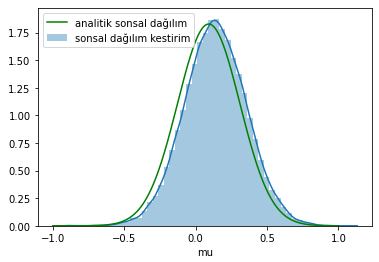

Emre: From genetics and GPS positioning to nuclear research, RADAR and robotics, and even financial forecasting — Markov Chain Monte Carlo (MCMC) seems to pop up anywhere machine-learning meets complex probability distributions.

Can you explain the intuition of MCMC without diving too deep into mathematical proofs? Why is it so important?

Kaan: Absolutely. But first, let’s take a step back and ask where this whole Monte Carlo idea came from in the first place.

## Problem – What if we cannot compute the posterior analytically?

In the Kalman-filter post we managed to evaluate the posterior distribution analytically. But life is rarely that kind. In dynamical, non-linear systems — especially when the distribution is non-Gaussian — that integral becomes intractable. Throw a few hundred or thousand parameters into the model and the integral is completely out of reach.

Emre: Why exactly is the posterior hard to compute?

Kaan: Let’s recall Bayes’ rule:

$$
P(\theta\mid x)=\frac{P(x\mid\theta)\,P(\theta)}{P(x)}
$$

The target of desire is the posterior $P(\theta\mid x)$. Multiplying the prior $P(\theta)$ with the likelihood $P(x\mid\theta)$ is the easy part. The troublemaker is the denominator $P(x)$, a.k.a. the **evidence**:

$$
Z=P(x)=\int_{\Theta} P(x\mid \theta)\,P(\theta)\,d\theta
$$

If we can’t do that integral, we can’t normalise the distribution — and that breaks everything.

Emre: So we find an approximation?

Kaan: Exactly. If only we could draw samples **from** the posterior itself we could approximate any expectation with Monte Carlo simulation. But to sample we first need… the posterior. Catch-22.

That’s where **Markov Chain Monte Carlo** enters the stage: it lets us draw samples *as if* they came from the posterior **without** evaluating that impossible integral.

## Markov Chain Monte Carlo

MCMC is built from three core ideas:

* **Monte Carlo (MC) approximation**
* **Markov Chain (MC again!)**
* **Metropolis–Hastings (MH) acceptance rule**

### 1  Monte Carlo Approximation

Monte Carlo is the go-to trick when expectations or integrals are too ugly to solve. By the Law of Large Numbers, the sample average of a function converges to its expectation as the number of samples $N$ grows:

$$
\mathbb E[f(X)] \approx \frac1N\sum_{i=1}^N f(x^{(i)})
$$

Early versions trace back to Buffon’s needle problem (estimating $\pi$). The name “Monte Carlo” was coined in the 1940s at Los Alamos during the Manhattan Project.

### 2  Importance Sampling (a stepping stone)

Suppose the evidence integral 
$Z = \int p(x\mid\theta)\,p(\theta)\,d\theta$ 
is impossible. Pick a *proposal* distribution $q(\theta)$ that’s easy to sample and “close” to the posterior, and rewrite:

$$
Z = \int \frac{p(x\mid\theta)\,p(\theta)}{q(\theta)}\,q(\theta)\,d\theta = \mathbb E_{q}[W(\theta)]
$$
where $W(\theta) = \frac{p(x\mid\theta)\,p(\theta)}{q(\theta)}$ are importance weights.

With samples from $q$ we approximate $Z$ by an average of the weights.

Great — yet in high dimensions the number of samples explodes as $N^K$ (the curse of dimensionality). We need something smarter.

### 3  Markov Chain

A Markov chain’s next state depends only on the current state: $\theta_t \sim q(\,\cdot\mid \theta_{t-1})$. If the chain is **ergodic** and its stationary distribution equals the posterior, then *after it settles (the burn-in)* each draw is effectively a sample from the posterior.

But how do we guarantee convergence to the right stationary distribution? Enter Metropolis–Hastings.

### 4  Metropolis–Hastings Acceptance Rule

Given the current state $\theta^{(i)}$:

1. Propose $\theta^* \sim q(\,\cdot\mid \theta^{(i)})$.
2. Compute the acceptance ratio
   $$
   r=\min\left\{1,\frac{p(x\mid \theta^*)\,p(\theta^*)\,q(\theta^{(i)}\mid \theta^*)}{p(x\mid \theta^{(i)})\,p(\theta^{(i)})\,q(\theta^*\mid \theta^{(i)})}\right\}
   $$
3. Accept the proposal with probability $r$. Otherwise stay put.

Note how the nasty evidence $Z$ cancels out in the ratio — magic!

Repeat the loop and the chain eventually wanders through parameter space in proportion to the posterior density.

---

## A Walk-Through Example

Let the likelihood be $x\mid\mu \sim \mathcal N(\mu,1)$, standard deviation known, with a Normal prior $\mu\sim \mathcal N(0,1)$. Generate 20 observations around zero:

```python
import numpy as np, matplotlib.pyplot as plt, seaborn as sns
from scipy.stats import norm

np.random.seed(225)
obs = np.random.randn(20)
plt.hist(obs, bins='auto')
```

Because the prior is conjugate we *could* compute the posterior analytically — convenient for benchmarking the sampler.

### Analytical Posterior

```python
def posterior_pdf(x, obs, mu0=0, sigma0=1):
    sigma = 1.0
    n = len(obs)
    mu_post = (mu0/sigma0**2 + obs.sum()/sigma**2)/(1/sigma0**2 + n/sigma**2)
    sigma_post = 1/(1/sigma0**2 + n/sigma**2)
    return norm(mu_post, np.sqrt(sigma_post)).pdf(x)
```

### Metropolis Sampler

```python
N = 100000
mu = 1.0          # initial guess
prop_sd = 0.2     # proposal std dev
samples = []
accept = 0

for _ in range(N):
    mu_star = norm(mu, prop_sd).rvs()
    # likelihoods
    lik_cur = norm(mu, 1).pdf(obs).prod()
    lik_star = norm(mu_star, 1).pdf(obs).prod()
    # priors
    prior_cur = norm(0,1).pdf(mu)
    prior_star = norm(0,1).pdf(mu_star)
    r = min(1, (lik_star*prior_star)/(lik_cur*prior_cur))
    if np.random.rand() < r:
        mu = mu_star
        accept += 1
    samples.append(mu)
print("Efficiency:", accept/N)
```

Plotting the histogram of the samples (after discarding, say, the first 500 as burn-in) overlays almost perfectly with the analytical posterior.



## Real-World Pitfalls

1. **Dependence on Initial Values** – Discard an initial *burn-in* period.
2. **Autocorrelation** – Because consecutive samples are correlated, effective sample size is lower. *Thinning* (keeping every $n$-th sample) can help, but increases run time.

Advanced samplers (Gibbs, Hamiltonian Monte Carlo) tackle these issues in smarter ways.

## Takeaways

* MCMC provides posterior samples without computing intractable integrals.
* With those samples we can estimate:
  1. Parameter posteriors
  2. Predictive distributions
  3. Model comparison metrics
* Be mindful of burn-in, autocorrelation, and computational cost.

## References

1. *Machine Learning: A Probabilistic Perspective*, Kevin P. Murphy
2. *Approximate Inference using MCMC*, Ruslan Salakhutdinov
3. *Monte Carlo Yöntemleri* (Slides, TR), Sinan Yıldırım
4. *Importance sampling & Markov chain Monte Carlo*, Nando de Freitas
